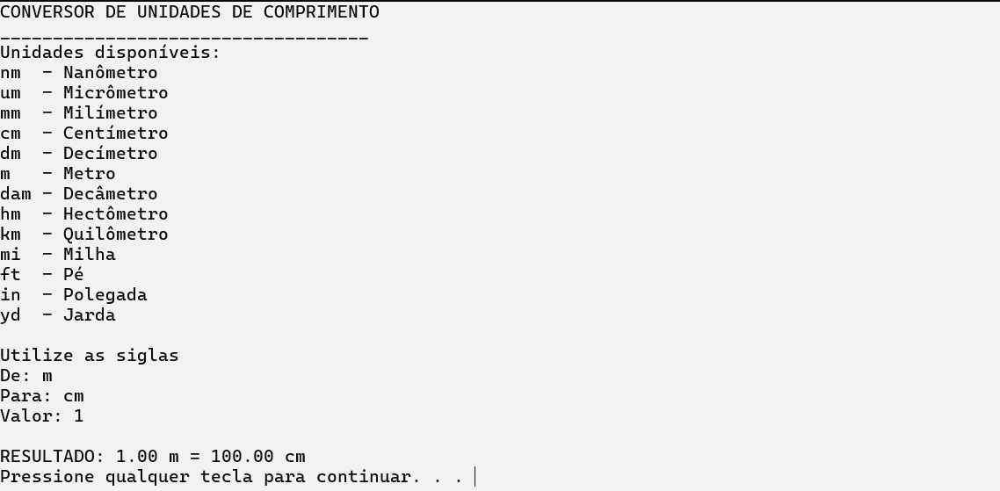

# 🔄 Conversor de Unidades em C++

> Um conversor de unidades completo desenvolvido em **C++**, com suporte a diversas categorias como **comprimento, massa, tempo, temperatura, área e volume**, utilizando interface em terminal e modo **claro/escuro**.

## 🚀 Funcionalidades

- 🔄️ Conversão entre diferentes categorias de unidades:
- 📏 Comprimento (metros, centímetros, polegadas, pés...)
- ⚖️ Massa (gramas, quilogramas, libras...)
- ⏱️ Tempo (segundos, minutos, horas...)
- 🌡️ Temperatura (Celsius, Fahrenheit, Kelvin)
- 📐 Área (m², km², hectares...)
- 🧪 Volume (litros, ml, galões...)
- 🌓 Suporte a **modo escuro e claro**
- ✅ Código limpo, organizado e comentado

## 📸 Preview do sistema
> Interface baseada em terminal com cores e opções navegáveis:

## 🌓 Modo claro/escuro

## 📏 Converter comprimento

---

## 📂 Como Usar

1. Compile o código com um compilador C++.
2. Execute o `.exe` gerado.
3. Crie sua conta e comece a usar!.

---

## 💡 Tecnologias Utilizadas

- C++(Dev-c++)
- Terminal: Git Bash
- Design modular com separação por funções

---

## 📌 Observações

- Este projeto é de uso acadêmico e pessoal.
- Sinta-se à vontade para contribuir ou adaptar ao seu cenário.

---

## 📝 Licença

Este projeto está sob a licença MIT.  